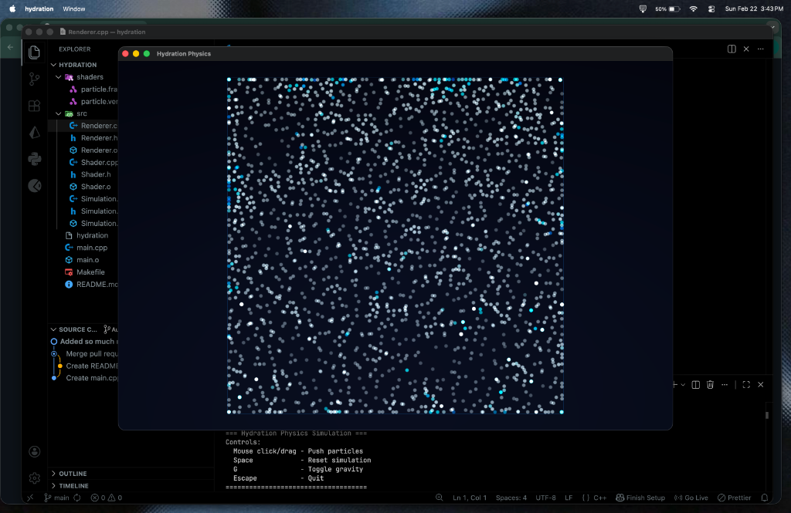

# 💧 Hydration Physics Simulation

A real-time fluid physics simulation built with **C++** and **OpenGL**, using **Smoothed Particle Hydrodynamics (SPH)** to simulate realistic water behavior. ~2000 particles flow, splash, and interact with your cursor in real time.



## 🚀 Getting Started

### Clone the Repository

```bash
git clone git@github.com:kane-hash/hydration.git
cd hydration
```

### Prerequisites

- **macOS** with Xcode Command Line Tools
- **Homebrew** package manager

Install dependencies:

```bash
brew install glfw glm
```

### Build & Run

```bash
make
./hydration
```

## 🎮 Controls

| Key             | Action                   |
| --------------- | ------------------------ |
| **Mouse hover** | Repels particles         |
| **Space**       | Reset simulation         |
| **G**           | Toggle gravity direction |
| **Escape**      | Quit                     |

## 🧪 How It Works

The simulation uses **SPH (Smoothed Particle Hydrodynamics)** with:

- **Poly6 kernel** for density estimation
- **Spiky kernel** for pressure forces
- **Viscosity kernel** for fluid damping
- **Spatial hashing** for efficient neighbor search
- **Sub-stepping** (4 steps/frame) for stability

## 📁 Project Structure

```
hydration/
├── main.cpp              # Entry point, window, input handling
├── Makefile              # Build configuration
├── shaders/
│   ├── particle.vert     # Vertex shader
│   └── particle.frag     # Fragment shader (blue→cyan coloring)
├── src/
│   ├── Simulation.h/cpp  # SPH fluid engine
│   ├── Renderer.h/cpp    # OpenGL particle renderer
│   └── Shader.h/cpp      # Shader loading utilities
└── assets/
    └── screenshot.png    # Preview image
```
